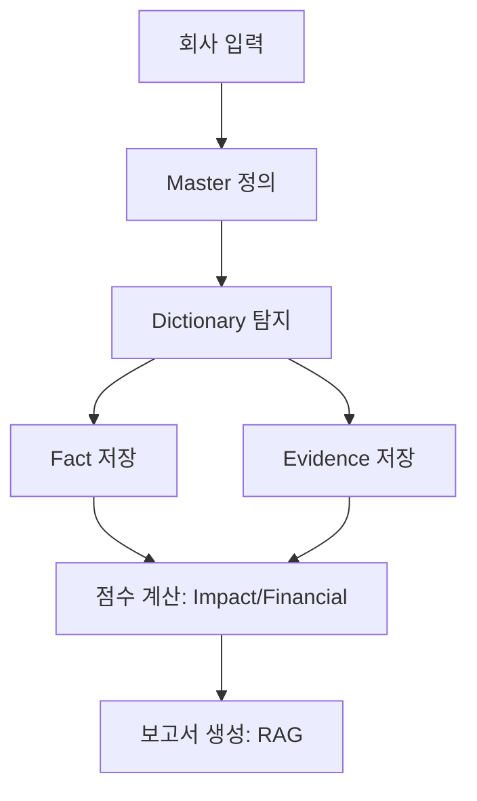
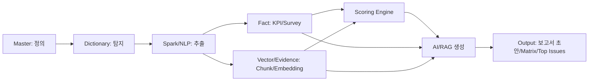

# Phase 0 교육 패키지: ESG 보고서 자동 생성 플랫폼 공통 언어와 경계 정의

## 요약

본 Phase 0 산출물의 목적은 “기능을 더 만드는 것”이 아니라, 팀(아키텍트·개발·데이터·NLP·컨설턴트·PM)이 **같은 언어로 같은 시스템을 이해**하도록 고정하는 것입니다. 내부 사양에서 제시된 7단계 프레임(회사 입력→Master 정의→Dictionary 탐지→Fact 저장→Evidence 저장→점수 계산→보고서 생성)과 5개 레이어 철학(Master=정의, Dictionary=탐지, Fact=데이터, Vector/Evidence=근거, AI=생성)을 ‘변경 금지 규칙’으로 문서화하고, 특히 **Issue–Metric–KPI Fact의 책임 경계**와 **Signal/Fact/Judgment의 점수 입력 분리**를 팀 공통 언어로 확정하는 것이 핵심입니다. fileciteturn0file0

이 프로젝트가 “이중중대성(Impact/Financial) 평가”를 중심에 두는 것은 유럽 ESRS가 **double materiality를 impact materiality + financial materiality**로 정의하기 때문이며, ESRS는 “materiality”를 기본적으로 이 double materiality 의미로 사용합니다. citeturn0search6turn0search10 반면 IFRS 지속가능성 공시(ISSB)는 투자자 의사결정에 유용한 정보(기업 현금흐름/자금조달/자본비용 등 ‘prospects’에 영향을 주는 정보)에 초점을 둔 “글로벌 베이스라인”을 지향합니다. citeturn0search0turn0search9 또한 GRI는 조직의 **가장 중요한 impacts(경제·환경·사람/인권에 미치는 영향)와 그 관리**에 대한 투명성을 강조합니다. citeturn1search8 국내 K-ESG는 정부가 관계부처 합동으로 발표한 가이드라인으로, 국내외 지표를 분석해 공통 핵심 항목을 정리해 기업의 ESG 경영을 지원하기 위한 목적을 명시합니다. citeturn0search7turn0search1

## 빠른 참고 치트시트

아래는 교육/온보딩 시 “1페이지로 들고 가는” 요약입니다(문서/위키 상단 고정 추천).

### 혼동 금지 4대 규칙

| 구분 | 한 줄로 | 현장에서 자주 나는 사고 |
|---|---|---|
| Issue ≠ Metric | Issue는 “주제(평가 단위)”, Metric은 “측정 범주(저장 단위)” | KPI를 issue_id에 바로 저장/조인해서 값이 섞임 |
| Metric ≠ KPI Fact | Metric은 “항목”, KPI Fact는 “회사·기간별 실제 값(출처 포함)” | 값이 덮어써져서 감사/재현 불가 |
| Evidence ≠ Generated Narrative | Evidence는 “근거(원문)”, Narrative는 “근거를 바탕으로 생성된 문장” | 생성문장을 근거로 착각(환각·책임 불명) |
| Signal ≠ Final Score | Signal은 “외부 징후”, Score는 “signal+fact+judgment의 결과” | 뉴스량만으로 점수 결정(왜곡) |

### 7단계 흐름 한 문장

**입력(회사) → 기준(정의) → 탐지(사전) → 사실(정형)·근거(비정형) 저장 → 점수(Impact/Financial) 산출 → 근거 기반 보고서 생성**. fileciteturn0file0

### Phase 0 합격 기준(최소)

- 팀원이 15개 용어를 **한 줄 정의**로 설명하고, “혼동 금지 4대 규칙”을 즉시 구분한다.
- 7단계를 단계별로 **입력/출력/저장소(테이블)**까지 연결해 말할 수 있다. fileciteturn0file0
- 5개 레이어에서 “하는 일/안 하는 일”을 예시로 설명할 수 있다. fileciteturn0file0

## 문서 A 용어집

아래 15개는 내부 사양에서 “헷갈리면 회의가 꼬이는 필수 구분 용어”로 제시된 범위를 기준으로 정리했습니다. fileciteturn0file0  
표의 “직접 컬럼”은 **(1) 내부 사양에 명시된 핵심 컬럼**과 **(2) Phase 0 교육 목적상 권장되는 최소 컬럼(권장 표기)**을 함께 제공합니다.

| 용어 | 한 줄 정의 | 금지 혼동 쌍 | 직접 컬럼 목록(핵심) | 실무 예시 | 연결 관계 설명(핵심) |
|---|---|---|---|---|---|
| Issue | ESG 평가·보고의 **상위 주제 단위**(중대성 평가의 기본 단위) | Issue ≠ Metric / Issue ≠ KPI Fact | `issue_id(PK)`, `esg_domain`, `issue_group`, `issue_name`, `report_section`, `priority` | “기후변화”, “산업안전”, “반부패” | Issue는 **Metric(측정)**과 Evidence(근거)를 묶고, **Impact/Financial Score의 키**가 된다. |
| Metric | Issue를 측정/관리하기 위한 **측정 범주(저장·추적의 기준 단위)** | Metric ≠ Issue / Metric ≠ KPI Fact | `metric_id(PK)`, `issue_id(FK)`, `metric_name`, `metric_group`, `unit`, `data_type`, `calculation_logic`, `priority` fileciteturn0file0 | “온실가스 배출 성과”, “재해 성과” | **KPI Fact는 metric_id로만 연결**(KPI↔Issue direct link 금지). fileciteturn0file0 |
| KPI | 관리/공시 대상이 되는 지표 “항목”(일상 용어의 KPI) | KPI ≠ KPI Fact / KPI ≠ Evidence | *(권장)* `kpi_code`, `kpi_name`, `unit_hint`, `period_type_hint` | Scope1/2/3, TRIR, 이직률 | KPI는 “항목”, KPI Fact는 “값”. KPI는 Metric의 세부 항목으로 모델링되며, 저장은 Fact에 한다. |
| KPI Fact | 회사·기간·Metric 기준으로 저장되는 **실제 값(정량/정성)** + 출처 메타 | KPI Fact ≠ Metric / KPI Fact ≠ Evidence | `fact_id(PK)`, `company_id`, `metric_id`, `period_year`, `period_type`, `value_numeric`, `value_text`, `unit`, `source_document_id`, `source_page`, `confidence_score`, `is_estimated`, *(권장)* `version_no`, `is_latest` fileciteturn0file0 | 2024 Scope1=12,000 tCO2e(출처 p.34) | 점수 계산과 보고서 표/서술의 “사실” 입력이므로 **버전·출처**가 필수다. fileciteturn0file0 |
| Master | 보고 대상/규칙을 정의하는 **Canonical Registry(정의 레이어)** | Master ≠ Dictionary / Master ≠ Fact | `issue_id`, `issue_name`, `esg_domain`, `issue_group`, `data_type`, `unit`, `calculation_logic`, `report_section`, `priority`, `evidence_link_key`, `vector_ref_key` fileciteturn0file0 | “온실가스” 이슈의 단위·계산로직·보고서 섹션 정의 | Master 정의가 기준이 되고, Dictionary/Fact/Vector/AI는 이를 “참조”한다. fileciteturn0file0 |
| Dictionary | 문서/텍스트에서 정보를 찾기 위한 **탐지 사전(탐지 레이어)** | Dictionary ≠ Master / Dictionary ≠ Evidence | `issue_id`, `spark_primary_keywords`, `spark_synonyms_and_acronyms`, `spark_negative_keywords`, `spark_regex_hint`, `rag_query_seeds`, `table_or_section_hint`, `unit_hint` fileciteturn0file0 | “Scope 1”, “직접배출”, “tCO2e”, 제외어 | Spark/NLP는 Dictionary로 후보를 탐지하고, Fact/Evidence로 “정착”시킨다. fileciteturn0file0 |
| Evidence | 보고서·점수·감사의 **근거가 되는 원문(비정형)** | Evidence ≠ Generated Narrative / Evidence ≠ KPI Fact | `document_id`, `source_page`, `text` 또는 `object_ref`, *(연결키)* `issue_id` 또는 `evidence_link_key` fileciteturn0file0 | “2030 감축 목표” 정책 문단 | Evidence는 Chunk로 쪼개 Vector에 저장되며, AI 생성은 Evidence를 인용해야 한다. fileciteturn0file0 |
| Chunk | Vector 검색을 위한 Evidence의 **최소 검색 단위(문단/문장/표 설명)** | Chunk ≠ Document / Chunk ≠ KPI Fact | `chunk_id`, `document_id`, `issue_id`, `text`, `embedding`, `source_page` fileciteturn0file0 | SR p.34 “Scope 1 배출…” 문단 | Chunk는 issue_id 필터/메타와 함께 retrieval에 쓰이며 인용 단위가 된다. |
| Signal | 뉴스/규제/외부데이터 등 **외부 징후 입력**(점수의 구성요소) | Signal ≠ Final Score / Signal ≠ Evidence | *(권장)* `signal_id`, `source_type`, `issue_id`, `timestamp`, `severity_score`, `reference` | 규제 강화 기사 급증 | Signal은 “점수 컴포넌트”로만 쓰며, 단독 점수화는 금지다. fileciteturn0file0 |
| Judgment | 설문/인터뷰/평가 등 **사람의 판단 입력** | Judgment ≠ Fact / Judgment ≠ Signal | `response_id`, `company_id`, `issue_id`, `question_id`, `response_value`, `response_score`, `respondent_type` fileciteturn0file0 | 내부 설문 “재무 영향 4/5” | Judgment는 Fact와 분리 저장되어 explainable scoring에 합산된다. fileciteturn0file0 |
| Impact Materiality | 기업이 환경·사회에 미치는 영향 관점의 중요도(impact) | Impact ≠ Financial | `impact_score`, *(권장)* `impact_components`, `threshold` | 지역사회/환경 영향이 큼 | ESRS는 double materiality의 한 축으로 impact materiality를 정의한다. citeturn0search6turn0search10 |
| Financial Materiality | ESG 이슈가 기업 재무/기업가치에 미치는 영향 관점 중요도(financial) | Financial ≠ Impact | `financial_score`, *(권장)* `financial_components`, `threshold` | 탄소가격으로 비용 급증 가능 | ESRS의 financial materiality 및 ISSB의 “prospects(현금흐름 등)” 관점과 정합한다. citeturn0search6turn0search9 |
| Score (Impact/Financial) | Issue별 평가 결과(반드시 2축: impact/financial) | Score ≠ Signal / Score ≠ Narrative | `score_id`, `company_id`, `issue_id`, `impact_score`, `financial_score`, *(권장)* `score_version_id`, `calculated_at`, `trace_id` fileciteturn0file0 | 기후변화 Impact 82 / Financial 74 | 점수는 signal+fact+judgment 합산이며, 사후 설명(trace)이 필요하다. fileciteturn0file0 |
| Report Section | 최종 보고서에서 배치될 목차/섹션(템플릿 anchor) | ReportSection ≠ Issue / ReportSection ≠ Evidence | `report_section`(Master), *(권장)* `report_section_id`, `template_id` fileciteturn0file0 | “환경-기후변화-배출현황” | Master의 report_section이 생성 엔진 Sub-topic/문단 구조의 기준점이 된다. |
| Stakeholder | 이해관계자(내부/외부)로서 중대성·설문·우선순위에 영향 | Stakeholder ≠ User(Role) | *(권장)* `stakeholder_group_id`, `group_name`, `survey_weight` | 직원/투자자/지역사회/고객 | GRI는 stakeholder 개념을 핵심 개념 중 하나로 다룬다. citeturn1search8 |

### 용어 연결을 “한 장으로” 설명하는 법

- **정의(Master)**에서 issue_id와 report_section을 고정한다. fileciteturn0file0  
- **탐지(Dictionary)**가 문서에서 Issue/Metric 관련 키워드를 찾아 **Evidence 후보(Chunk)**와 **KPI 후보**를 만든다. fileciteturn0file0  
- 숫자로 확정된 값은 **Fact(kpi_fact)**에 저장되고, 원문 근거는 **Vector/Evidence(vector_chunk)**에 저장된다. fileciteturn0file0  
- **Scoring**은 Signal+Fact+Judgment로 **Impact/Financial을 분리**해 산출한다(ESRS의 double materiality 정의와 정합). citeturn0search6turn0search10  
- **AI 생성**은 Issue만이 아니라, report_section 하위의 **Sub-topic 단위로 Evidence/Fact를 인용**하며 초안을 생성한다. fileciteturn0file0  

## 문서 B 서비스 흐름

내부 사양은 “PM이 7개 박스로 설명 가능해야 한다”는 학습 프레임을 제시합니다. fileciteturn0file0 아래는 교육용으로 확장한 “단계별 책임·테이블·리스크” 버전입니다.

### 전체 박스 다이어그램

### 단계별 상세(입력/출력, 책임자, 테이블/컬럼, 실패 리스크)

> 표의 “주요 테이블/컬럼”은 내부 Phase0 노트의 핵심 컬럼(예: Master/Dictionary 컬럼, Fact 컬럼)을 기준으로 정리했습니다. fileciteturn0file0

| 단계 | 핵심 목적 | 입력 예시 | 출력 예시 | 책임자(역할) | 주요 테이블/컬럼(예시) | 실패 리스크 | 통제/예방 포인트 |
|---|---|---|---|---|---|---|---|
| 회사 입력 | 데이터 수집 시작점(원천 확보) | KPI 엑셀/수기/API, PDF 업로드, 설문/인터뷰 | 업로드 완료 이벤트, 원천 파일, raw 입력 | client_admin / consultant_admin | *(권장)* `company`, `document`, `raw_upload_log` | 단위/기간 혼재, 스키마 불일치, 권한 오류 | 입력 템플릿, unit 표준화, 업로드 검증, RBAC 선적용 |
| Master 정의 | “무엇을” 다룰지 정의 고정 | 기준체계(보고서 구조/매핑 룰) | Canonical issue registry | platform_admin + ESG SME | `issue_id`, `unit`, `calculation_logic`, `report_section`, `priority`, `evidence_link_key`, `vector_ref_key` fileciteturn0file0 | 정의에 키워드/값 혼입(레이어 붕괴) | Master 변경 승인/버전, Dictionary와 분리(정책) fileciteturn0file0 |
| Dictionary 탐지 | 문서에서 후보 추출(탐지) | 문서 텍스트 + Dictionary | 후보 Chunk, 후보 KPI | NLP/데이터 | `spark_primary_keywords`, `negative_keywords`, `regex_hint`, `rag_query_seeds` fileciteturn0file0 | 오탐/미탐, 비용 과다(issue별 full scan) | issue_id 필터, negative 키워드, batch 중심 운영 |
| Fact 저장 | 확정된 KPI 값을 정형 저장 | 사용자 확정 KPI + 추출 후보 | kpi_fact 적재 | 데이터 엔지니어 | `metric_master`, `kpi_fact`(company_id, metric_id, period, value, source_doc, confidence…) fileciteturn0file0 | issue direct link, 값 덮어쓰기 | metric 경유 강제, version_no/is_latest, source linkage 의무 |
| Evidence 저장 | “근거”를 검색 가능한 형태로 저장 | 원문 문서, 후보 Chunk | vector_chunk(embedding), 문장 근거 | 데이터 플랫폼 | `document_id`, `chunk_id`, `issue_id`, `text`, `embedding`, `source_page` fileciteturn0file0 | 출처 끊김, 민감정보 노출 | page/document_id 강제, 접근 로그, 마스킹/암호화 |
| 점수 계산 | 이중중대성 점수 산출 | Signal + Fact + Judgment | impact_score + financial_score | ESG/Quant Owner | *(권장)* `scoring_version`, `scoring_result`, `scoring_trace` | 설명 불가(블랙박스), 버전 혼재 | score_version 고정, component trace 저장(재현성) |
| 보고서 생성 | 근거 기반 보고서 초안 생성 | Issue + Sub-topic + Evidence + KPI | 보고서 초안 + 근거 drill-down | AI/ESG Writer | *(권장)* `report_run`, `generation_log` | Evidence 없는 생성(환각), 섹션 불일치 | Evidence-first 게이트, human review, report_section 제약 |

### 역할(Responsibility) 교육 포인트

- **platform_admin**: Master/Dictionary/권한/버전 정책을 “깨지지 않게” 관리(프로덕트 운영 책임). fileciteturn0file0  
- **consultant_admin / consultant_user**: 프로젝트 수행(데이터 입력·검토·점수/문장 검토) 주체. fileciteturn0file0  
- **client_admin / client_viewer**: 자기 회사 데이터 입력/조회(최소권한). fileciteturn0file0  
- **auditor_viewer**: 읽기 전용+근거/이력 중심(감사 대응). fileciteturn0file0  

## 문서 C 레이어 분리 원칙

레이어 분리는 “코드 스타일”이 아니라 **신뢰성·감사·확장성**의 전제입니다. 내부 사양은 Master/Dictionary/Fact/Evidence의 역할을 분리해야 한다는 원칙을 반복해 강조합니다. fileciteturn0file0

### 레이어 상호작용 다이어그램

### 레이어별 “하는 일/안 하는 일/컬럼/인터페이스/운영 노트”

| 레이어 | 하는 일 | 안 하는 일 | 핵심 컬럼(대표) | 인터페이스(연결 방식) | 운영 노트(버전·오너·주기) |
|---|---|---|---|---|---|
| Master=정의 | 무엇을 수집/평가/보고할지 정의(목차·단위·로직·매핑) | 키워드 저장, 값 저장, 생성문장 저장 | `issue_id`, `unit`, `calculation_logic`, `report_section`, `priority`, `evidence_link_key`, `vector_ref_key` fileciteturn0file0 | 모든 레이어가 `issue_id`를 참조(읽기 전용 원칙) | 변경은 파급이 크므로 **승인+버전**이 필수(분기/반기 단위 권장) |
| Dictionary=탐지 | 문서에서 “무엇을 찾을지” 규칙 제공(키워드/정규식/섹션 힌트) | 정의 변경, 값 저장, 점수 저장 | `spark_primary_keywords`, `negative_keywords`, `regex_hint`, `rag_query_seeds` fileciteturn0file0 | Spark/NLP batch가 Dictionary를 consume | 튜닝이 빈번(주/월). precision/recall 기준으로 개선, 버전 관리 권장 |
| Fact=데이터 | 정형 값 저장(회사·기간·Metric) + 설문/인터뷰 저장 | 키워드/정의 혼입, 근거 원문 전체 저장 | `company_id`, `metric_id`, `period_*`, `value_*`, `source_document_id`, `confidence_score` fileciteturn0file0 | Scoring과 Report가 consume(조회) | **버전/출처** 없으면 감사/재현 불가. 값 수정은 audit 대상 |
| Vector/Evidence=근거 | 근거 텍스트 저장·검색(Chunk+Embedding+출처) | 정의/값/점수 저장 | `document_id`, `chunk_id`, `issue_id`, `text`, `embedding`, `source_page` fileciteturn0file0 | RAG retrieval, scoring evidence component | 문서는 보통 immutable로 두고(원본 보존), 접근제어·로그 필수 |
| AI=생성 | 정의+값+근거를 소비해 보고서 문장 생성(초안) | 근거 없는 생성, 정의/값을 DB처럼 저장 | *(권장)* `prompt_version`, `retrieved_chunk_ids`, `output_text`, `review_state` | Output 생성 + 인간 검토 루프 | 프롬프트/모델/검색 파이프는 반드시 버전 관리(재현성) |

### 표준/기준과 레이어 설계의 정합성(교육용 해설)

- **ESRS의 double materiality(impact+financial)**는 점수 모델을 “단일 점수 금지”로 설계해야 하는 근거입니다. citeturn0search6turn0search10  
- **ISSB(글로벌 베이스라인)**는 투자자 관점의 “financial effects(현금흐름·자본비용 등)”을 강조하므로 Financial 축 설계에 직접적 힌트를 줍니다. citeturn0search0turn0search9  
- **GRI**는 조직의 가장 중요한 impacts 및 stakeholder 개념을 핵심 개념으로 다루므로 Impact 축/Stakeholder 설계의 정합성 근거로 활용할 수 있습니다. citeturn1search8  
- 국내 **K-ESG 가이드라인**은 정부가 기업 지원 목적의 참고 가이드임을 명시하며, 국내외 지표를 분석해 공통 핵심 항목을 정리한 취지가 있어 Master의 매핑/우선순위 정책과 연결됩니다. citeturn0search7turn0search1  

(표준/기준 설명은 필요 최소 수준으로만 포함했고, Phase 0의 주 목적은 내부 경계 합의입니다.)

## 문서 D PM 체크리스트 답변집

내부 사양의 16개 질문은 Phase 0 이해도를 빠르게 점검하는 데 충분히 유효합니다. fileciteturn0file0 아래는 **교육용 “표준 답안”**이며, 이어서 “Phase 0에서 자주 빠지는 추가 핵심 문항”을 보강했습니다.

### 표준 Q&A

**Q1. issue_id가 왜 canonical key인가?**  
Issue는 정의/탐지/데이터/근거/점수/보고서가 모두 참조해야 하는 공통 축이기 때문이다. fileciteturn0file0

**Q2. Master와 Dictionary를 왜 분리했는가?**  
정의 변경과 탐지 튜닝은 목적·책임자·변경 주기가 다르므로 레이어를 분리해야 한다(정의가 탐지 로직에 오염되는 것을 방지). fileciteturn0file0

**Q3. report_section은 왜 필요한가?**  
정의가 보고서의 “어디에 쓰이는지”까지 연결돼야 AI 생성이 일관된 문단 구조로 출력된다. fileciteturn0file0

**Q4. evidence_link_key는 어디에 쓰는가?**  
정형 KPI와 비정형 근거를 drill-down/감사/보고서 인용에서 연결하는 참조 키다. fileciteturn0file0

**Q5. Metric과 KPI Fact의 차이는?**  
Metric은 측정 범주이고, KPI Fact는 회사·기간별 실제 값(+출처/신뢰도)이다. fileciteturn0file0

**Q6. KPI Fact는 왜 issue가 아니라 metric 기준으로 저장해야 하나?**  
Issue는 상위 개념이라 값의 단위/기간/버전 관리가 불안정해진다. 하나의 Issue에 여러 KPI가 매달리므로 저장 기준은 Metric이어야 한다. fileciteturn0file0

**Q7. source_document_id를 왜 남겨야 하나?**  
근거 추적이 없으면 점수/보고서가 검증·감사·수정 불가능해져 실무에서 바로 실패한다. fileciteturn0file0

**Q8. impact와 financial은 왜 분리해야 하나?**  
ESRS의 double materiality는 impact materiality와 financial materiality 두 차원을 전제로 한다. citeturn0search6turn0search10

**Q9. 뉴스 점수는 왜 최종점수가 아니고 signal인가?**  
외부 징후일 뿐이며, 내부 성과(Fact)·근거(Evidence)·사람 판단(Judgment)과 결합돼야 한다(“signal+fact+judgment” 원칙). fileciteturn0file0

**Q10. 최종 top issue는 무엇을 합산해서 나오나?**  
Issue별 impact_score와 financial_score를 기준으로 도출하며, 각 점수는 signal/fact/judgment 컴포넌트의 합산 결과여야 한다. fileciteturn0file0

**Q11. Issue만으로 문장 생성이 안 되는 이유는?**  
Issue는 분류명이고, 보고서 문장은 Sub-topic과 Evidence(근거)·KPI(사실)가 있어야 작성 가능하다. fileciteturn0file0

**Q12. sub-topic은 왜 필요한가?**  
보고서 문단은 “현황/전략/리스크/거버넌스”처럼 더 구체적인 문단 주제가 필요하다. fileciteturn0file0

**Q13. Evidence 기반 생성이 왜 중요한가?**  
근거 없는 생성은 ESG 공시/보고에서 신뢰를 잃고, 감사/검증이 불가능하기 때문이다. fileciteturn0file0

**Q14. company_id 분리가 왜 필수인가?**  
멀티 기업 SaaS에서 데이터 혼합은 치명적 보안 사고이며, 원천적으로 차단해야 한다(모든 주요 테이블에 company_id). fileciteturn0file0

**Q15. consultant와 client 권한은 왜 달라야 하나?**  
컨설턴트는 여러 프로젝트를 운영/분석해야 하고, 고객은 자기 회사만 접근해야 한다. fileciteturn0file0

**Q16. audit log가 왜 필요한가?**  
누가 언제 무엇을 수정했는지 없으면 점수/문장/데이터 변경의 책임 추적이 불가능해 감사 대응이 무너진다. fileciteturn0file0

### Phase 0에서 추가로 빠지기 쉬운 “필수” PM 질문

**Q17. Master 변경이 왜 위험한가?**  
Master는 report_section/단위/로직/매핑을 바꾸므로 생성 템플릿과 데이터 해석까지 파급된다. 따라서 승인·버전·마이그레이션 정책이 필요하다. fileciteturn0file0

**Q18. Dictionary 튜닝은 무엇으로 성공/실패를 판단하는가?**  
표본 문서 기준 precision/recall(또는 오탐/미탐)과 검토 시간 비용(컨설턴트 작업량)을 함께 본다(탐지 정확도는 운영비에 직결). fileciteturn0file0

**Q19. score_version이 왜 필수인가?**  
가중치/정규화/입력 소스가 바뀌면 과거 결과 재현이 안 되므로, 점수는 반드시 버전과 함께 저장해야 한다(재현성·감사). fileciteturn0file0

**Q20. 보고서 버전이 왜 필요한가?**  
초안→검토→수정→승인 과정에서 산출물 변경이 일반적이므로, “최종본”을 정의하려면 버전/승인 상태가 있어야 한다. fileciteturn0file0

### Phase 0 Acceptance Criteria(합격 판정) — 운영 가능한 수준으로

- **교육 합격(팀)**: 15개 용어·7단계·5레이어를 팀원 80% 이상이 같은 정의로 설명하고, 혼동 금지 4대 규칙을 즉시 구분한다.
- **문서 합격(산출물)**: Master/Dictionary/Fact/Evidence/AI의 “하는 일/안 하는 일”이 문서 A~C에 명시돼 있고, 금지 사항(혼합 금지)이 체크리스트로 존재한다. fileciteturn0file0
- **설계 합격(다음 단계 진입 조건)**: KPI 저장이 Issue direct link 없이 Metric 경유로만 이뤄지도록 데이터 모델 원칙이 합의되어 있다. fileciteturn0file0

## 출처와 다운로드

### 다운로드

- [Phase0_ESG_교육패키지_v1_1.docx 다운로드](sandbox:/mnt/data/Phase0_ESG_교육패키지_v1_1.docx)

### 출처

- 내부 프로젝트 Phase 0 노트 및 Master/Dictionary/Facts/보안 방향 요약(사용자 제공). fileciteturn0file0  
- ESRS의 double materiality(impact materiality + financial materiality) 정의: citeturn0search6turn0search10  
- EFRAG의 ESRS/CSRD 맥락(기술자문·위임법 채택 등): citeturn0search8turn0search15  
- ISSB의 IFRS S1/S2 발행 및 글로벌 베이스라인 개요, TCFD 권고 반영: citeturn0search0turn0search3  
- ISSB/IFRS 지속가능성 공시의 “prospects(현금흐름/자본비용 등)” 중심 설명: citeturn0search9  
- GRI Standards의 목적(조직의 impacts 및 투명성), stakeholder/impact/material topics 개념: citeturn1search8  
- SASB Standards 개요(77개 산업, 투자자 의사결정 유용성, ISSB가 책임): citeturn1search0turn1search1  
- 한국 K-ESG 가이드라인(관계부처 합동 발표, 목적/개요): citeturn0search7turn0search1