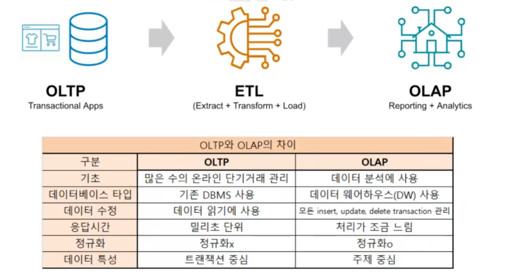

ETL(Extract Trans)
앱을 사용한 로그, 정규DB, 비정규 files, 웹사이트 기록, 이메일 등의 정보를 수집하는 방식  
-> 공공데이터포털에서 받거나(오픈API) 원하는 정보가 있는 사이트에서 스크립(크롤링)하거나(/robots.txt 수집조건 확인)  
-> 사이트를 제작하면 robots 정책을 넣어줘야함


# BeautifulSoup
HTML/XML 문서에 접근하고 데이터를 추출함

## 메서드

| 메서드 | 설명 | 예시 코드 |
| :--- | :--- | :--- |
| **`find()`** | 조건에 맞는 첫 번째 태그 찾기 🔍 | `soup.find('div', class_='content')` |
| **`find_all()`** | 조건에 맞는 모든 태그 리스트 반환 📚 | `soup.find_all('a')` |
| **`select()`** | CSS 선택자로 모든 요소 탐색 🎯 | `soup.select('div.article > h2')` |
| **`select_one()`** | CSS 선택자로 첫 번째 요소 반환 ☝️ | `soup.select_one('#main > p')` |
| **`get_text()`** | 태그 내부의 텍스트만 추출 (공백 제거) ✨ | `element.get_text(strip=True)` |
| **`get()`** | 태그의 특정 속성 값(href 등) 가져오기 🔗 | `link.get('href')` |


`soup.select_one('#main > p')`: main이라는 ID안의 직계자식인  모든 p태그 찾아옴
---

## JS방식으로 찾기
```
$('div.main_brick div').find('brick-vowel')
```
class명이 main_brick인 div의 자식 div들 중에서 class명이 brick-vowel인 것

## BeautifulSoup방식으로 찾기
예시 1
```
from bs4 import BeautifulSoup
import requests

url = "http://finance.naver.com/"
res = requests.get(url)

print(res)

soup = BeautifulSoup(res.text, 'lxml')
# lxml은 빠른 파싱을 원할 때 사용

print("타이틀: ",soup.title)
# title = head 안의 타이틀. tag랑 같이 나옴
print(soup.title.text)
# text 그 안의 내용만 뽑아줌
print("Tag: ",soup.find("h1"))
# find 가장 첫번째 태그를 찾아줌
print("Tag Text: ",soup.find("h1").text)

```
### 파싱 엔진
- `html.parser`: 설치 필요 없으며 보통의 속도
- `lxml`: 빠른 파싱이 가능함, 설치 필요함


예시2
```
from bs4 import BeautifulSoup
import requests

url = 'https://news.naver.com/'
response = requests.get(url)
# print(response)

soup = BeautifulSoup(response.text)

# 모든 뉴스 제목 가져오기
titles = soup.select('a[href*="025"]')
# `*=:` 포함하는 모든 것 (=Like)
# 내가 원하는 정보 찾아오기 위해 사이트(F12)통해 class나 태그명으로 찾아옴

parent = soup.find("div", class_="grid1_wrap brick-house _brick_gid_wrapper")
# `recursive = False` 바로 아래 단계인 '직계 자식(Direct Children)' 태그들만 검사하고 멈춤
# True 하면 모든 div 다 찾아옴
# data = parent.find_all("div", class_="brick-vowel _brick_column")
parentdivs = parent.find_all("div", class_="brick-vowel _brick_column")

# print (parentdivs)
print (parentdivs[1].get_text(strip=True))
# strip=True /n, /t같은 줄바꿈 자동 제거
```
----

# SQL
## VIEW CREATE문
```sql
CREATE VIEW edu.`category` AS
SELECT 'GN0100' AS `code`, '발라드' AS `name`
UNION ALL
SELECT 'GN0200' AS `code`, '댄스' AS `name`
```
셀렉해서 보려는 항목 아래로 쭉 union all 하면 됨

## insert와 update 동시 진행하기
```sql
sql2 = f"""
          INSERT INTO edu.`melon` 
          (`id`, `img`, `title`, `album`, `cnt`, `genre`)
          VALUE
          (%s, %s, %s, %s, %s, %s)
          ON DUPLICATE KEY UPDATE
            id=VALUES(id),
            img=VALUES(img),
            title=VALUES(title),
            album=VALUES(album),
            cnt=VALUES(cnt),
            genre=VALUES(genre)
      """
      values = [(row["id"], row["img"], row["title"], row["album"], row["cnt"], genre) for row in arr]
      saveMany(sql2, values)
```
여기서 
```
 VALUE
          (%s, %s, %s, %s, %s, %s)
```
부분이 python에서 받아오는 문자열을 표시하는 부분. => 이후에 python에 values에서 읽어옴  
=> ONLY SQL문에서 쓰려면 `($s)`에 값 직접 넣어 하드코딩 하면 됨