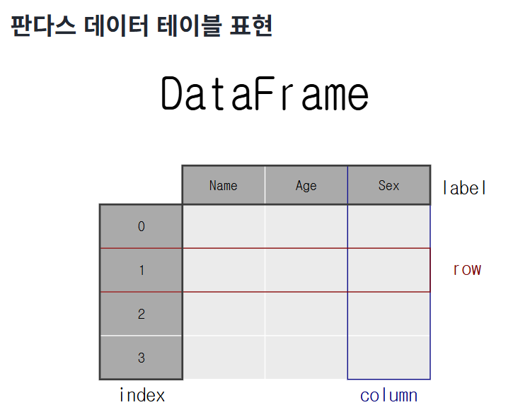

# streamlit
[streamlit 사이트](https://streamlit.io/)

## streamlit 실행하기
실행 명령어
```
uv run streamlit run main.py
```
streamlit을 먼저 실행 -> 그 안에서 main.py 실행

## streamlit 명령어
- head
    - `.set_page_config()`: ()안에서 내용 지정
        - `(page_title="제목")`: 헤더의 타이틀
        - `page_icon="👀"`: 헤더 아이콘 설정
        
- body
`.title("내용")`: h1


**python은 시스템 켜져있어도 라이브러리 설치 가능**

# pandas

```
import pandas as pd

+ pandas 라이브러리 설치 필요
```


데이터를 이런 형식의 테이블로 변환해줌  

```
변수 = pd.DataFrame(가져올 데이터)
st.dataframe(변수=pandas로 테이블에 들어갈 수 있게 처리한 데이터)
```

## pandas 메소드
1. 데이터 확인
- df.head(n): 상위 $n$개 행 확인 (기본값 5)df.- tail(n): 하위 $n$개 행 확인
- df.info(): 데이터 타입, Non-Null 개수, 메모리 사용량 등 전체 요약 정보 확인
- df.describe(): 숫자형 데이터의 기술 통계량(평균, 표준편차, 최솟값, 사분위수 등) 확인
- df.shape: (행, 열)의 개수를 튜플로 반환 (예: (100, 5))
2. 데이터 선택
- df.columns: 컬럼명들만 확인
- df.sort_values(by='컬럼명'): 특정 컬럼 기준 정렬 (ascending=False면 내림차순)
- df.loc[행, 열]: 이름을 기준으로 데이터 선택
- df.iloc[행_인덱스, 열_인덱스]: 숫자를 기준으로 데이터 선택
- df.unique(): (특정 컬럼에서) 중복을 제거한 고유값 확인
3. 데이터 가공
- df.drop(columns=['컬럼명']): 특정 컬럼 삭제
- df.rename(columns={'옛이름': '새이름'}): 컬럼 이름 바꾸기
- df.astype({'컬럼명': '타입'}): 데이터 타입 변환 (예: 문자열을 숫자로)
- df.isnull() / df.isna(): 빈 값(결측치)인지 확인
- df.fillna(값): 빈 값을 특정 값으로 채우기
- df.apply(함수): 각 행이나 열에 사용자 정의 함수를 일괄 적용 (매우 강력!)
4. 데이터 분석
- df.groupby('컬럼명'): 특정 기준별로 데이터를 그룹화 (예: 장르별 평균 조회수)
- df.value_counts(): 특정 컬럼의 값별 개수 세기 (예: '멜론'에 등록된 가수별 곡 수)
- df.mean(), df.sum(), df.max(): 평균, 합계, 최댓값 산출
- df.corr(): 컬럼 간의 상관계수 계산