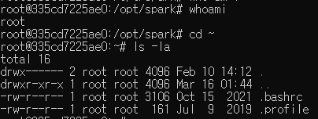

# Apache Spark
- 대규모 데이터를 메모리 기반(In-Memory) 으로 빠르게 처리
- 분산 환경(여러 서버)을 한 컴퓨터처럼 사용
- 배치 처리 + 스트리밍 처리 + 머신러닝 + SQL + 그래프 처리 지원
=> 즉 저장소임, 다운받으면 Hadoop이 같이 깔린다.  
    - Hadoop = 빅데이터(방대한양의 정형/비정형 데이터 집합) 저장소 
    - map>>reduce함 
- [사이트](https://spark.apache.org/)  
- 개발 언어: java, python, scala  
- 리눅스로 사용해야해서 기본 ubuntu 사용
## spark 다운받기
JAVA가 있어야만 실행되므로 자바 먼저 다운받기!!

# JAVA 설치하는 방법
[아카이브](https://jdk.java.net/archive/)
```
21.0.1 (build 21.0.1+12)
Windows	64-bit	zip 188M (sha256)
```
- zip파일 설치 후 해당 경로 복사
- 환경변수에 `JAVA_HOME`:경로 저장
- + path에 `%JAVA_HOME%\bin` 추가

### 1. cmd에서 수동으로 다운로드 받기
- ubuntu 이미지 다운로드
: docker run -d -it ubuntu

이 두 폴더가 사용자와 시스템에 관련된 파일이 저장되어있음
cat 폴더명 해서 내용 볼 수 있음
.bashrc에 사용하는 거 추천
export JAVA_HOME=/usr/lib/jvm/java-21-openjdk-amd64
export SPARK_HOME=opt/spark/spark-4.1.1-bin-hadoop3
export PATH=$PATH:$SPARK_HOME/bin
 환경변수 설정하는 명령어

### 2. docker로 다운받기
```dockerfile
FROM ubuntu:22.04
RUN apt-get update
RUN apt-get -y install wget ssh curl openjdk-21-jdk python3-pip procps net-tools
RUN pip3 install jupyter pyspark

# Download and extract Spark
WORKDIR /opt/spark
RUN wget https://dlcdn.apache.org/spark/spark-4.1.1/spark-4.1.1-bin-hadoop3.tgz
RUN tar -zxvf spark-4.1.1-bin-hadoop3.tgz
RUN rm spark-4.1.1-bin-hadoop3.tgz

# Set Spark environment variables
ENV JAVA_HOME=/usr/lib/jvm/java-21-openjdk-amd64
ENV SPARK_HOME=/opt/spark/spark-4.1.1-bin-hadoop3
ENV PYSPARK_PYTHON=/usr/bin/python3
ENV PATH="$PATH:${SPARK_HOME}/bin:${SPARK_HOME}/sbin"
ENV SPARK_NO_DAEMONIZE=true

# Expose ports
EXPOSE 8888
EXPOSE 8080
EXPOSE 7077
EXPOSE 4040

# Start Jupyter Notebook
CMD ["jupyter", "notebook", "--port=8888", "--no-browser", "--allow-root", "--ip=0.0.0.0"]
```
**dockerfile 수정할 경우 무조건 image 버전 바꿔서 새로 build해야함**  
--> 기존 builds가 남아있어서 수정 전 버전으로 돌아감  

1. 보통 opt가 외부파일 설치하는 폴더임
2. cd opt -> ls -l -> mkdir spark -> cd spark  
이게 전부 합쳐진게 workdir, run1번까지
3. tar은 target  /  -zxvf가 압축 풀기
4. 압축 풀었으니 용량차지하지 않도록 zip파일 비우기

### 2-1. compose.yml 생성하기
```yml
services:
  master:
    container_name: master
    image: my-spark:2
    ports:
      - 8080:8080
      - 7077:7077
    environment:
      - SPARK_PUBLIC=localhost
      - SPARK_MODE=master
    command: start-master.sh

  worker:          
    image: my-spark:2
    container_name: spark-worker
    ports:
      - 8081:8081
    depends_on:     
      - master
    environment:
      - SPARK_PUBLIC_DNS=localhost
      - SPARK_MODE=worker
      - SPARK_MASTER_URL=spark://master:7077 
    command: start-worker.sh spark://master:7077
```
## 위 방식 오류로 인해 compose.yml 생략
```
docker run -d -p 8888:8888 -p 4040:4040 -p 8080:8080 -p 7077:7077 -v ./data:/opt/spark/works --name spark-jupyter my-spark:3 
```
### 2-1. command: master container 켜기
```cmd
docker exec -it master bash
root@5487a86281c0:/opt/spark# cd spark-4.1.1-bin-hadoop3/sbin
// 폴더 위치 이동
root@5487a86281c0:/opt/spark/spark-4.1.1-bin-hadoop3/sbin# ls -la
// 해당 폴더에 있는 파일들 확인
root@5487a86281c0:/opt/spark/spark-4.1.1-bin-hadoop3/sbin# bash ./start-master.sh
// 파일 중 ./start-master.sh에 접속
starting org.apache.spark.deploy.master.Master, logging to /opt/spark/spark-4.1.1-bin-hadoop3/logs/spark-root-org.apache.spark.deploy.master.Master-1-5487a86281c0.out
```
- sh: 리눅스에서 사용하는 쉘스크립트
    - 텍스트를 특별한 프로그램 없이도 `Vim`, `Notepad`같은 텍스트 에디터로 내용 수정 및 확인 가능


# pip vs uv
- pip는 PC 전체에 설치
- uv는 해당 프로젝트에 설치

# python으로 spark 실행하기
C:\Users\hi\Desktop\수아\fullstack-journey\practice_file\0316\backend\main.py
```
uv add ipykernel
```
```main.py
from pyspark.sql import SparkSession

spark = SparkSession.builder.appName("PySpark WorkCount Test").master("spark://localhost:7077").getOrCreate()
```
- uv run main.py 하면 터미널에서 실행됨

# jupyter로 spark 실행하기
## uv형식 jupyter 설치
- 프로젝트 생성(init)
- 해당 위치에 jupyter 모듈 설치
```
uv add --dev ipykernel
```
- jupyter 실행
```
uv run --with jupyter jupyter lab
```
하면 자동으로 크롬 실행됨

**OR**

파일명.ipynb 파일 생성 후 코드 입력  
C:\Users\hi\Desktop\수아\fullstack-journey\practice_file\0316\backend\test1.ipynb

# Map Reduce
방대한 데이터를 여러 컴퓨터에 나누어 일을 시킨 후 결과를 하나로 합치는 Hadoop 기술
jupyter에서 실행했는데 반응이 오지 않으면 켜놓은 터미널 보면 됨. 돌아가고있는지 에러났는지
글자를 나눠서 저장하는게 hadoop, 다시 가져오는게 spark, 각 단어들을 셔플하여 같은 애들끼리 합치는게 reduce
```
counts = rdd.flatMap(lambda x: x.split()).map(lambda word:(word, 1)).reduceByKey(lambda a,b: a+b)
print(counts, type(counts))
```
- `.map()`: 데이터를 하나씩 꺼내 내가 정한 규칙대로 변형
- `lambda word : (word, 1)`: `lambda`는 익명함수, word라는 이름으로 단어 하나를 꺼냄 -> `(word,1)`: (hello,1),(spark,1) 형태로 튜플을 만듦
- `lambda a, b: a + b`: `a`: 지금까지 합쳐진 누적값 (Running Total),  
`b`: 새로 들어온 값 (New Value),  
`a + b`: 두 값을 더해서 새로운 누적값으로 업데이트하라는 뜻

## docker에 파일 업로드하기
- 업로드 할 파일 위치 docker에서 확인  
- `spark-4.1.1-bin-hadoop3`있는 위치가 파일 업로드할 위치임  
- 지금은 `opt/spark`  
- 프로젝트에 data넣을 폴더 및 파일 생성
- 해당 위치에 동일한 이름의 폴더 만들기
```
docker exec -it master bash
mkdir data(폴더명)
```
- 빠져나온 후 터미널에 copy명령어 입력
```
docker cp docker cp sample.txt(프로젝트 파일위치+파일명) master(컨테이너명):/opt/spark/data/sample.txt(파일위치+파일명)
```
```
Successfully copied 2.05kB to master:/opt/spark/data/sample.txt
```
- 해당 명령어 뜨면 성공!

