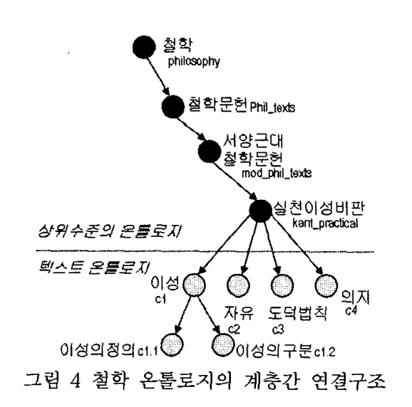
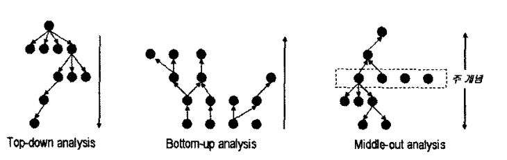

# 온톨로지란?
인간의 언어를 컴퓨터 언어로 표현하고 이를 컴퓨터가 사용할 수 있게 하는 모델

---

## 철학적 의미
아리스토텔레스의 '제1철학'에서 시작됨  
존재하는 것(ontos) + 학문(logos)의 합성어, 현재는 On-To-Knowledge 고대 그리스에 시작된 학문 `존재론`  
20세기 초 형이상학으로 발전하게 됨.  
어떠한 대상이 존재하는가(실재론자) vs 존재하지 않는가(반실재론자)로 대립.  
대상의 범주는 추상적 또는 이상적 형상 , 보편자 , 비물질적 정신, 정신과 독립적인 세계, 가능하지만 실제적이지는 않은 대상, 본질, 자유의지 , 그리고 신이 포함된다.  
존재하는 모든 것들을 어떻게 분류하고 관계를 설명할 수 있는가.의 근본적 탐구  
무엇이 존재하는가? 존재란 무엇인가?
**'Are There Xs?' , 'Do Xs exist'**

--- 

## 주요 특징 및 역할
온톨로지는 특정 도메인 내에서 개념간의 관계를 구조적으로 정의하는 지식 체계이다.  
* 여기서 도메인이란 `데이터가 속한 주제나 환경`을 의미한다. = 특정 맥락이나 산업분야  
자연어 처리 중 `문맥적 의미`를 정밀하게 이해한다.  
특히 **감성 분석**에서 강점을 드러낸다.
- 계층적 구조: 클래스(=개념, 사물이나 개념에 붙이는 이름), 속성, 관계, 인스턴스로 구성
    - 개념: 이름, 하나 이상의 개념명을 가짐.
           단일명사, 복합명사, 명사구로 설정.
    - 속성: 개념을 설명하는 속성
        내적 속성: URI 주소로 접근할 수 없는 지식자원(텍스트 데이터=literal)
        외적 속성: URI로 접근 가능한 인트라넷 또는 인터넷 웹페이지, 파일, db등
    - 관계: 'is-a', 'part-of'
    * is-a: `상속/분류` like "사과는 과일이다."같은 **일반화 관계**.
            하위 클래스 is a 상위 클래스
    * part-of: `집합/구성요소` like "엔진은 자동차의 일부이다." 같은 **포함관계**
              컴포넌트 part of 전체  

  

    ex) 감성 분석에서
    - 클래스: 긍정 감성 / 부정 감성
    - 인스턴스: 개념에 속하는 단어(슬픔, 외로움, 행복...)
    - 관계: 단어가 문맥과 상호작용하는 방식

=> 기존 감정분석 연구는 어휘사전 기반으로 단어 단위로 감성 점수 계산, 기계 학습 및 딥러닝 모델 활용
    => 문맥 반영 어려움 + 특정 도메인에서는 다르게 해석됨( ex)`도전`, IT/스포츠 분야: 긍정적, 정치분야: 위협적)

  

- 정확도(Accuracy)
- 정밀도(Precision)
- 재현율(Recall)
- F1-score: 정밀도와 재현율의 조화평균. 두 지표의 균형을 맞추어 0~1 사이의 값으로 나타내며, 1에 가까울수록 모델 성능이 우수함을 의미
- 비교 대상 모델: 감성 어휘 사전 기반 모델, 전통적인 기계 학습 모델(SVM, Naïve Bayes), 딥러닝 기반 감성 분석 모델(BERT 기반 한국어 감성 분석 모델), 오픈소스 LLM을 활용한 Zero-shot, Few-shot 감성 분석 기법

속성 분류  
개념적  
관계적  
계층구조  
명시성  
공유 가능성  

---

### 도메인 지식 분석 기법
1) 하향식 기법(top-down approach)
2) 상향식 기법(bottom-up approach)
3) 상하향식 기법(middle-out approach)

  

---

## AI에서 필요한 이유
단순한 패턴 학습을 너머 사유하는 AI.  
구글 - Knowledge Graph: 온톨로지 기반(다중 도메인 기반의 지식 저장소의 지식을 그래프로 표현하는 기술)  
  
이러한 관계 분석을 통해 AI 스스로 단어나 문맥을 파악하고 판단하여 결과값을 도출할 수 있게 됨.
ex) "샐러드용 채소 추천해줘", "파스타용 과일 소스 추천해줘." 라는 질문에 `토마토`는 식물학적 관점에서:과일, 요리 관점에서: 채소라는 지식을 통해 두가지 질문에 모투 '토마토'라는 적절한 답변을 고려할 수 있게됨.
의료, IT, 과학기술 등 다양한 분야에서 도움이 될 것.

기존의 LLM은 통계적으로 가장 높은 값을 진실로 도출해냄.  
ai는 이게 진짜 진실인지 아닌지를 알 수 없음. 단순히 통계적으로 많은 값을 추출할 수 있을 뿐임.  
-> 인간이 거짓을 학습시키면 ai는 이것이 진실이 되어 값을 도출함.

---

### 나의 해석
온톨로지의 존재론은 어떻게 보면 양자역학의 슈뢰딩거의 고양이 실험과 비슷한 느낌이 아닌가?
실험: 1시간 후에 절반의 확률로 청산가스가 담긴 병이 깨진다. -> 1시간 후 상자를 열어보기 전까지는 고양이가 죽어있는지 살아있는지 알 수 없는 중첩된 상태로 공존한다.(실제가 아니라 논리로만 진행하는 사고실험)
단순 단어 기반으로 계산하여 결과값을 도출하는 방식에서
전체 문맥과 맥락을 이해할 수 있는 llm의 탄생

## Neo4j 알아보기

