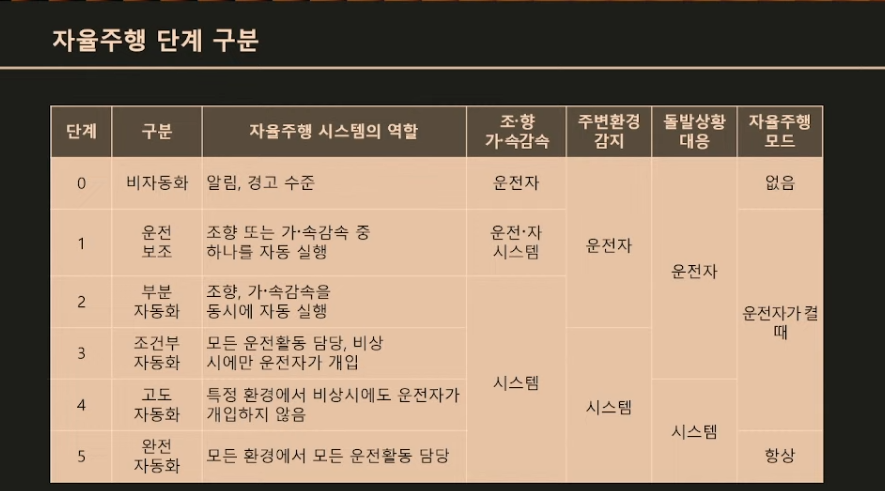
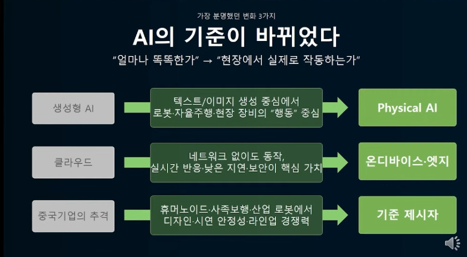
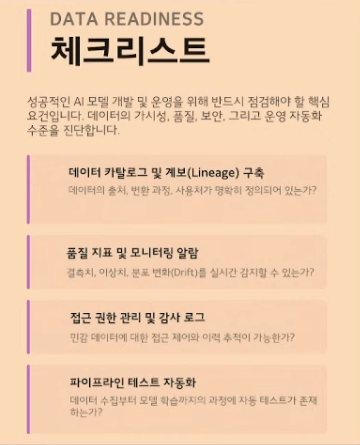

Physical AI
- google waymo의 자율주행 택시(2018 출시->2020 안전드라이버 없이 완전 self주행)
웨이보, 카카오택시 서비스중
라이다(빛 감시 시스템)로 주변 상황 감지 => 비용 문제 발생
- 테슬라의 자율주행(E2E, FSD), Robotaxi, Robovan(벤)
- 중국 Apollo, 뤄보콰이파오, Pony.ai

- 한국 2020부터 자율주행 관련 법 시행(시범운행지구에서 유상으로 여객 운송함 - 세종시에서 첫 시작)
26년 1월부터 개정안 발안. 익명 처리 없이 연구개발 가능하도록 함

공장/생산시설에서 단순 반복작업 -> 서비스 로봇(보안순찰, 청소, 서빙, 배달 등) -> 인간 외형의 휴머노이드(테슬라의 옵티머스, 보스톤 다이내믹스의 아틀라스, 오픈 AI가 투자한 피규어 AI)
왜 인간형 휴머노이드가 되었냐 => 이미 인간에게 편하게 맞춰진 생활반경에 다른 형태의 로봇을 생산하여 이 로봇의 동선을 위해 수정하는 비용보다 이미 완성된 생활환경에 맞는 인간형 로봇을 제작하는 것이 비용적 절감이 됨

피지컬 AI의 문제점
- 사고 발생시 제조사(로봇 제작 공장)의 책임이되는가, 발명사쪽의 책임이 되는가
- 일자리 문제

MAIED: maumAI Edge Device
- VLA(Vision-Language-Action) 자율주행 WoRV(과수원 농약처리, 특이사항 발생시 예외처리 입력 가능함)
- 서비스로봇 Alden: 대화 가능, 비용 반의반으로 절감함(기준이 먼데??)
- 퀄컴기반 SUDA모듈: 대화형 공기청정기(LLM, STT, TTS 탑제 => llm통해 인터넷 없이도 사용 가능하도록 함)
- 베리어프리 키오스크 '마음터치': 휠체어 사용자를 위해 디바이스 높이 조절, 시각장애인 위한 점자셀 
농업, 차량, 건설장비까지 확장성

긍정적관점 => 노동시간 문제가 줄어듦

기술키워드
VLA: 인식 -> 판단 -> 행동 통함시킴
ex) NVIDIA 알파마요(차량자율주행중 공이 굴러감 -> 사람이 나올것이라 판단 -> 정지)
On-Device: 보안 안정성 오프라인대응 가능, 클라우드를 거치지 않음
ex) 인티그리티 스노캣
Vertical Intergration: 
ex) M.ax얼라이언스 Alice
Autonomy: 규칙 기반이 아닌 상황 판단, 의사 결정이 가능해짐
ex) 현대자동차 아틀라스
Robot SI: 여러 로봇을 관제시스템을 통해 하나로 관리 가능
ex) 삼성전자 스마트싱스 로봇관제, 지멘스 산업용로봇 통합관제플랫폼

로봇끼리 명령 가능(명령과 가까운 위치의 로봇에게 명령전달 등) => 엣지추론(클라우드 들리지 않고 현장, 즉 기기 자체에서 결과 도출하는 기술)  

기업 맞춤형 AI 구축 사례 => 데이터 설계 전략

