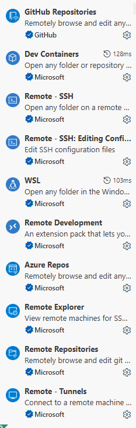

커널: 하드웨어와 소프트웨어를 연결해주는 운영체제의 핵심 엔진

Docker hub에서 이미지 다운로드 CLI

```bash
docker pull ubuntu:24.04
```

- `docker`: 도커 명령어
- `pull`: 다운받음
- `ubuntu`: 이미지 이름
- `:`: 이미지 이름과 태그 구분자
- `24.04`: 태그 이름(버전)


Docker 이미지 확인
```
docker images
```

Docker시작
```
docker run -d -it --name ubt ubuntu:24.04
```
docker run [옵션] [컨테이너명] [도커 이미지]

run: 다운+실행 한번에 해주는 명령어
-d 백그라운드에서 동작하도록 함
-it 운영체 주소로 접속할 수 있음(t:터미널처럼 생기게 만들어줘서 i:입력할 수 있게 함)
--name 이름 지정

```
출력
d890aa89ab7f85e1f0829e391857c200cca6dfb5690b968215cb8c0ed83489fa
```
👆이미지 이름

운영체제 접속
```
docker exec -it ubt /bin/bash
```

ubt 방금 내가 만든 이름
/bin/bash: bash 방식으로 접속하겠다
```
출력
root@d890aa89ab7f:/# 
```
=>리눅스가 됨
-root: 사용자

docker 앱에 containers->Files들어가면 파일 어떻게 관리되어있는지 볼 수 있음

Docker/Linux 명령어

`ls` 한줄로 리스트 출력
`ls -l`: 깔끔하게 목록으로 출력
`ls -la`: 숨겨진 것 까지 출력
`su`: 사용자 변경
`su -`: 원래 사용자로 돌아감(But 비번 물어봄)
`exit`입력하면 취소하고 나가짐 ==> 이전으로 돌아가짐(user 잘못 바꿨을 때 쓰면 돌아올 수 있음)
`whoami`: 접속 사용자 확인
`useradd -m -s /bin/bash -c "홍길동" hong`: 사용자 생성 명령어
                                           "홍길동": 설명
                                           hong: 실제 이름
                                           
`passwd`: 비밀번호 지정
`cd ~`: 본인의 가장 첫 위치로 감
`mkdir`: 디렉토리 만들기


버전에 따라 get은 생략 가능함

` install -y`: `-y`는 질문 생략하고 무조건 깔라는 명령어
`install python3 -y`하면 python사용 가능
`python3 main.py`로 실행
`vi`: 메모장처럼 쓸 수 있음
`vi main.sh`: 뒤에 붙는게 파일명.sh 확장자

vsCode -Extensions(확장자 설치)에 remote 검색 후

이거 설치하면 `vi`없이도 편하게 사용할 수 있음

포트코드
포트를 강제로 지정해주는 코드
`docker run -d -it -p 80:5173 --name nd node:24.13.0`

여기 -p 이후에 써주는게 강제 지정됨
이후에 만든 폴더에 가서 vite.configs에 
```
export default defineConfig({
  plugins: [react()],
  base:"/",
  server: {
    host: true
  }
})
```

👆 이 설정 넣어주면 됨
그리고 뜬 local브라우저 접속 후 5173날리고 80입력하면 뜸

# devcontainer로 실행하기
`ctrl`+ `shift`+ `P`


# redis
서버 메모리(DB랑 같음)
브라우저를 닫거나 새로고침을 해도 지워지지 않음

## redis 설치
`docker pull redis:8.4.0`로 다운

## redis 실행 함수 작성

```
@app.get('/set')
def setRedis():
    client.setex('fastapi:100', 60*60*24, 'sooah')
    return {'status': True}

@app.get('/get')
def getRedis():
    result = client.get("fastapi:100")
    return {"result": result}

@app.get('/del')
def delete():
    client.delete("fastapi:100")
    return{"status":True}
```
이걸로 redis 생성/읽기/삭제

## 터미널 실행
`docker exec -it redis redis-cli`

CLI명령어로 생성/읽기/삭제도 가능
`SET fastapi:200 12345`
`GET fastapi:100` => "sooah" 읽어옴

종료: `exit`

