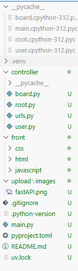

# FastAPI 시작하기
[fastAPI공식사이트](https://fastapi.tiangolo.com/ko/#create-it)
## Window에 UV 설치
```
powershell -c "irm https://astral.sh/uv/install.ps1 | more"
```

## 프로젝트 폴더 생성 후, UV 프로젝트 초기화
```
uv init .
```
## FastAPI 모듈 추가
```
uv add fastapi --extra standard
```

## main.py에 FastAPI 기본 설정
```
from fastapi import FastAPI

app = FastAPI()

@app.get("/")                 #Method
def read_root():
    return {"Hello": "World"}
```

## FastAPI 실행
```
uv run fastapi dev  #dev는 개발모드(로컬호스트만 뜸), 여기 run쓰면 배포모드(다른 ip로 접속 가능)
```

# Method
- get: read
- post: create
- delete: delete
- put: update
- patch: 부분수정용이나 잘 안 씀

```
from fastapi import FastAPI

app = FastAPI()

@app.get("/")
def get_root():
    return {"method": "GET"}

@app.post("/")
def post_root():
    return {"method": "POST"}

@app.put("/")
def put_root():
    return {"method": "PUT"}

@app.delete("/")
def delete_root():
    return {"method": "DELETE"}

@app.patch("/")
def patch_root():
    return {"method": "PATCH"}

@app.get("/test")
def test(key: str):     #annotation(어노테이션)
    return {"key": "test"}
```

## `@app.get("/")`의 역할
-`@`: 요청
“누군가가 / 주소로 GET 요청을 보내면 read_root 함수를 실행해라”
-`app`는 변수명, 아무거나 적어도 되지만 보통 app를 사용함

## `return {"Hello": "World"}`
FastAPI는 return으로 dict를 주면 👉 자동으로 JSON 응답으로 바꿔줌

## def test(key: str)
()안의 내용을 annotation이라고 함
- 코드에 설명이나 힌트를 붙이는 표식
- 타입 검사, 자동 문서 생성, 검증, 라우팅, 의존성 주입, 설정 자동 처리를 자동으로 해줌
```
def add(a: int, b: int) -> int:
    return a + b
```
- `->`은 return값의 타입 정해주는 것

## url주소로 정적파일 여는 방법

```
from fastapi.staticfiles import StaticFiles
import os 

static_dir = os.path.join(os.path.dirname(__file__),'images')
app.mount('/images',StaticFiles(directory=static_dir), name='images')
```
- `__file__`: 현재 실행중인 파이썬 경로
- `os`: 물리적 파일 관리할 때 사용
- `static_dir =~~`: url로 접근 가능하도록 경로 제작
- `app.mount(~~)`: ('url주소', 객체명(정적파일 위치), 이름)
- url에 정적파일명을 입력하면 해당 파일이 웹에 출력됨  
`http://127.0.0.1:8000/images/fastAPI.png`
- html, javascript, css도 정적파일이라서 실행 가능함
but! 백이랑 프론트랑 분리하는게 좋기 때문에 간단한 파일이나 이미지만 업로드해서 씀
- html파일에 css, js연결해주면 한번에 html링크에서 열어볼 수 있음
```
<link rel="stylesheet" href="/css/index.css">
<script src="http://127.0.0.1:8000/javascript/index.js"></script>
```

`http://127.0.0.1:8000/docs` 동적파일 관리하는 곳, 정적파일은 여기에 뜨지 않음

# Router
path(페이지 이동)관련 함수들을 관리하는 용도
파일 하나 생성 후 `APIRouter` 받아오기
```
새 파일

from fastapi import APIRouter

main = APIRouter(tags=['연습'])  #tags는 이름 설정해주는 용도

@main.get("/")
def get_root():
    return {"method": "GET"}
```
main.py에 해당 파일 받아오기
```
from root import main

app.include_router(main)
```
## APIRouter 옵션
1) `prefix='/주소'`: ''안에 기본 주소 설정해줄 수 있음 `prefix='/root'`이런식으로 해당 함수들 전부의 링크주소를 정해줄 수 있다.
2) `tags=['이름']`: Swagger(API 문서)에서 묶어주는 그룹 이름, 기능별로 정리하기 위해 사용
3) `dependencies=[Depends(check_login)`: 인증 보안을 위해 사용(로그인체크, 권한검사 등)
- 👇 관리자 전용 라우터 생성시 사용함
```
app.include_router(
    router,
    dependencies=[Depends(admin_only)]
)
```

- 보통 1),2)를 자주 사용함


# MVC 패턴
Model-View-Controller

view: UI, front
Controller: backend
Model: 데이터 + 비즈니스 규칙(앱이 다루는 내용물)

이 패턴에 맞춰 폴더들 분리해주는 게 좋음
fastAPI에 쓰는 파일들은 전부 controller

이런 형태로 관리하면 편함

