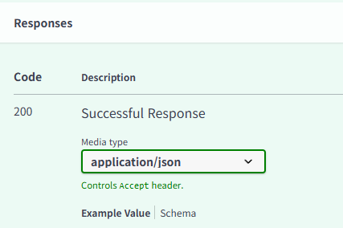

```
from fastapi import FastAPI  #전달용
from fastapi.responses import HTMLResponse #응답용
app = FastAPI() 

# @app.get('/') #주소
# def root():   #기능
#     return {'status':True}
#👆 '/'이 루트로 들어오면 root함수를 실행시키겠다는 의미

arr =[]
#dev로 실행하면 서버 종료시 까지 저장됨 / run으로 실행하면 새로고칠때마다 날아감

@app.get('/', response_class=HTMLResponse) #응답을 HTML형식으로 보내겠다는 의미
def root(txt: str = ''):   #txt =변수명, : str | None = type(str이거나 없거나) =None =기본값
    # arr.append(1)   # 새로고칠때마다 추가됨
    print(f'전달 받은 변수: {txt}')
    if txt == '':
        return '''
<body>
    <form>
        <input type='text', name='txt'/>
        <button type='submit'>전송</button>
    </form>
</body>
'''                                        # 그래서 return을 html형식으로 써줌
    else:
        arr.append(txt)
        html = ''
        for v in arr:
            html += f'<li>{v}</li>'
    return f'''
<body>
    <ul>
   {html}
   </ul>
    <a href='/'>돌아가기</a>
</body>
'''
```

get은 쿼리스트링 형식으로 데이터를 받아오고
post, put, delete, patch는 json형식으로 데이터를 받아옴
->그래서 데이터가 안 받아와짐  
  
여기서 보면 응답 형식 확인 가능  

html 형식으로 썼기때문에 Form()으로 형식 변환 해줘야 post로 받아올 수 있음
```
from fastapi import FastAPI, Form
from fastapi.responses import HTMLResponse

app = FastAPI()

arr = []

@app.get('/')
def get_root(txt):
    return {'status':True, 'txt':txt}

@app.post('/')
def post_root(txt: str =Form(여기도 초기값 지정가능)): #Form()안에 비어있으면 무조건 값이 있어야하고 초기값을 지정해주면 없어도 초기값이 들어감
    return {'status':True, 'txt':txt}

@app.get('/view', response_class=HTMLResponse)
def view():
    return'''
<body>
    <form action="/" methode='post'>
        <input type='text' name='txt'/>
        <button type='submit'>요청</button>
    </form>
</body>
'''
```
json은 언제 받아요? -> Javascript로 실행할 때


## 쿼리스티링방식
사용자가 주는 정보를 쿼리스트링 형식으로 받아옴. 
여러개면 &로 연결해줄 수 있음
`?`이후의 파라미터를 이름
해당 주소마다 맞춤형 데이터를 전달하기 위해 사용
- 공개된 정보를 주고받을 때 사용 가능
- 원하는 정보의 조건을 걸어줄 때 사용할 수 있음
- 같은 화면이나 보여지는 내용이 다를 때
- search, paging에 주로 사용함


## Form 방식
post는 기본적으로 JSON형식으로 정보를 받아오기 때문에
응답을 form형식으로 작성하면 post가 이 정보를 읽을 수 없음.
응답 형식과 같게 맞춰주는 방법 
- 로그인, 회원가입 등 보안이 필요한 정보들을 받을 때 사용
- bddy에 담아 전달해서 내용을 숨길 수 있음 
- get, post만 사용 가능함

## Path Variable
리소스를 식별해서 페이지를 보여줌
리소스란? 
리소스는 서버가 관리하는 대상(데이터), 사용자, 게시글, 상품, 주문 등등이 리소스임
쿼리랑 뭐가 달라요?
- 쿼리: `user/?id=1` -> id가 1일 때 라는 조건으로 사용자를 검색해옴
- path: `/user/1` -> 1번 사용자용 페이지