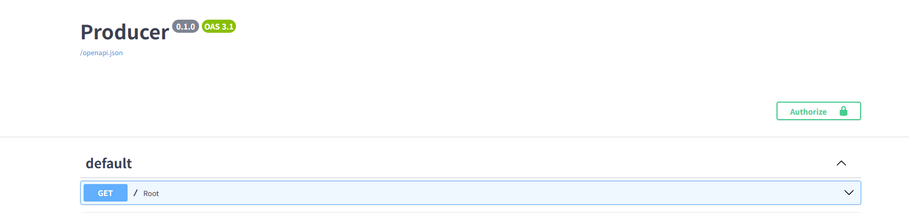

# Redis란?
서버 메모리(DB랑 같음)
브라우저를 닫거나 새로고침을 해도 지워지지 않음
**port 6379**

## python에서 실행
`uv add redis`
`import redis`

## redis 실행 함수 작성
```
client = redis.Redis(
  host="localhost",
  port=6379,
  db=0
)

@app.get('/set')
def setRedis():
    client.setex('fastapi:100', 60*60*24, 'sooah')
    return {'status': True}

@app.get('/get')
def getRedis():
    result = client.get("fastapi:100")
    return {"result": result}

@app.get('/del')
def delete():
    client.delete("fastapi:100")
    return{"status":True}
```
이걸로 redis 생성/읽기/삭제

# Redis method
1. `setex`
: set(값 설정)이랑 expire(시간 지정) 동시에 해줌
```
client.setex(key, 60*5, id)
```
- ()첫번째 key: 이름표, 데이터를 찾는 고유식별자임
       충돌 나지 않도록 고유하게 만들어야함(`key= uuid.uuid4.hex()`)
- ()두번째 60*3: 초단위 만료시간
- ()세번째 value: 실제로 저장할 값, 문자열 숫자열 다 가능
- 순서 중요함!

2. `get()`
:값 가져오기
```
client.get(key)
```

3. `ttl()`
: 남아있는 시간 확인
```
client.ttl(key)
```
- ttl: Time To Live

4. `delete`
: 즉시 삭제
```
client.delete(key)
```

# security = HTTPBearer()
```
def get_payload(credentials: HTTPAuthorizationCredentials = Depends(security)):
```


--------

# in Docker

## docker에 redis 이미지 받기
```
docker pull redis:8.4.0
```

## docker에 redis 컨테이너 만들기
```
docker run -d -p 6379:6379 --name redis redis:8.4.0
```

## 터미널 실행
`docker exec -it redis redis-cli`
-it 이후가 컨테이너명, /gi

CLI명령어로 생성/읽기/삭제도 가능
`SET fastapi:200 12345`
`GET fastapi:100` => "sooah" 읽어옴

종료: `exit`