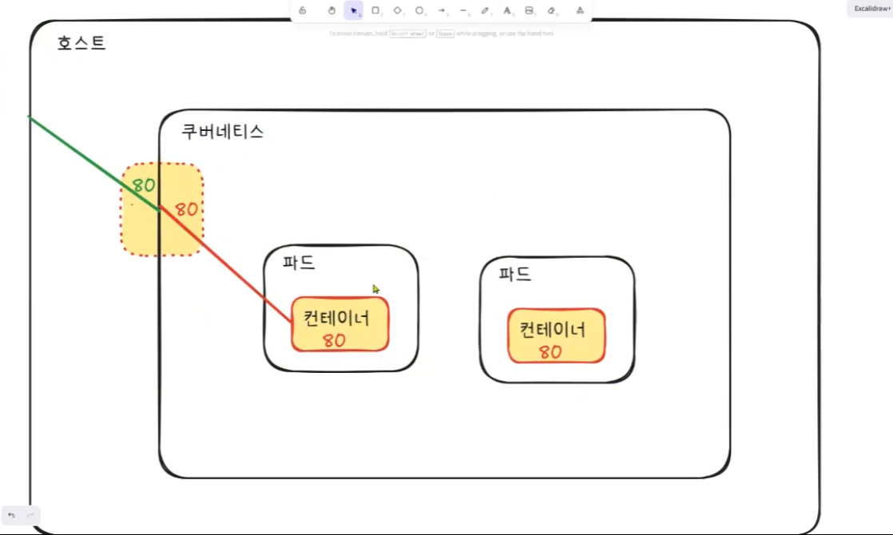

# 쿠버네티스
컨테이너화된 워크로드와 서비스를 관리하기 위한 이식할 수 있고, 확장 가능한 오픈소스 플랫폼

kubernetes에서 node는 컴퓨터라고 생각하면 됨: 자동생성됨  
deployments: Pod의 상태를 관리
명령어: `kubectl`로 시작

- 다양한 명령어 보기
```
kubectl api-resources

OR

kubectl --help
```

- 파드(Pod) 로그 설명 보기
```
kubectl logs --help
```

- Pod 생성
```
kubectl run web --image=nginx:1.28 --port 80
```
👉 이름이 web인 Pod를 생성해서  
👉 nginx:1.28 이미지를 실행하고  
👉 컨테이너 포트를 80으로 설정해라  

----
## 쿠버네티스와 Pod


여기서 host는 이 서비스를 이용하는 사용자의 PC(IP로는 Localhost)  

pod끼리 소통하는 방법은?    
IP로 직접 소통  
But Pod는 다운되었다 생길 때 마다 IP가 바뀜 => 하나의 service로 묶어줌(yaml파일의 metadata의 name)
- 서비스 Port 활성화(외부 접속 허용 설정)
```
kubectl port-forward pod/web 80:80
```

- pod 정보 보기
```
kubectl get pods

- pod들 정보 자세히 보기
kubectl get pods -o wide

- pod중에 하나(web2는 이름) 자세히 보기
kubectl get pod web2 -o yaml
```
- 접속하기
```
kubectl exec -it web -- /bin/bash
```
- nginx 명령어`curl`로 html 보기
```
curl localhost
```


# yaml파일로 컨테이너 생성하기

**yaml 작성시에는 Tab 사용 불가/ 무조건 들여쓰기 두번!!**
```yaml
apiVersion: v1
kind: Pod

# metadata는 pod이름
metadata:
  name: web2
spec:
  containers:
      # 여기의 name은 container 이름
      # name을 여러개 쓰면 한 pod안에 여러 컨테이너가 생김
    - name: web
      image: nginx:1.28
      # kubernets 이미지 정책상 docker hub에 없는 파일이면 이미지 다운이 안됨
      # 아래 명령어 = 이미지가 로컬에 없는 경우에만 내려받는다.
      imagePullPolicy: IfNotPresent
      #port는 안 써도 무방함
      ports:
        - containerPort: 80

```

- manifest file을 이용하여 pod생성
```
kubectl apply -f web-pod.yaml
```
-f이후는 내가 만든 yaml명으로 써야함

- pod 삭제
```
- 전부삭제
kube delete all --all

- 원하는 pod만 삭제
kubectl delete pod 파드이름
```

### 쿠버네티스 이미지 정책
이미지 풀(pull) 정책
컨테이너에 대한 imagePullPolicy와 이미지의 태그는 kubelet이 특정 이미지를 풀(다운로드)하려고 할 때 영향을 준다.

다음은 imagePullPolicy에 설정할 수 있는 값의 목록과 효과이다.

IfNotPresent  
이미지가 로컬에 없는 경우에만 내려받는다.  
Always  
kubelet이 컨테이너를 기동할 때마다, kubelet이 컨테이너 이미지 레지스트리에 이름과 이미지의 다이제스트가 있는지 질의한다. 일치하는 다이제스트를 가진 컨테이너 이미지가 로컬에 있는 경우, kubelet은 캐시된 이미지를 사용한다. 이외의 경우, kubelet은 검색된 다이제스트를 가진 이미지를 내려받아서 컨테이너를 기동할 때 사용한다.  
Never  
kubelet은 이미지를 가져오려고 시도하지 않는다. 이미지가 어쨌든 이미 로컬에 존재하는 경우, kubelet은 컨테이너 기동을 시도한다. 이외의 경우 기동은 실패한다. 보다 자세한 내용은 미리 내려받은 이미지를 참조한다.  
이미지 제공자에 앞서 깔린 캐시의 의미 체계는 레지스트리에 안정적으로 접근할 수 있는 한, imagePullPolicy: Always인 경우 조차도 효율적이다. 컨테이너 런타임은 노드에 이미 존재하는 이미지 레이어를 알고 다시 내려받지 않는다.

# 쿠버네티스 아키텍쳐


cluster -> node / namespace -> pod -> container

# namespace
하나의 node 안에 여러 namespace 생성 가능  
하나의 폴더라고 보면 됨  
논리적으로만 나눌 수 있음(not 물리)  
다양한 pod들(dev용, qa용, default용)을 구분하기 위함  

# POD
파드 안에 컨테이너를 여러개 생성할 수는 있지만 파드 하나당 컨테이너 하나가 기본베이스. 용도에 따라 하나 더 추가 할 수는 있음 ex) 로그 기록용 컨테이너

# Replica & Deployment
**Replica AS RC**  
같은 pod를 여러개 만들어주는 애(파드 개수 보장용)    
파드 죽으면 정해둔 개수만큼 다시 살려냄    

**Deployment AS De**
레플리카의 업그레이드 버전, 레플리카의 갯수를 늘려줌   
버전 업그레이드 할 때 기존 서비스파드는 켜둔 채로 하나씩 순차적으로 업그레이드 하는 방식 = De  
레플리카 1(기존) - 레플리카 2(새버전) 순차적으로 2 하나 생성 -> 1 하나 죽임 이런 방식으로 다 갈아엎음  
레플리카 2가 오류가나면 1을 다시 살려냄 => 1 하나 살림 -> 2 하나 죽임  
신규 올리는 거 Rolling Up  
기존 죽이는 거 Rolling Down  
버전 업그레이드를 많이 하다보면 RC가 여러개 쌓임 => 회사마다 정책으로 RC 몇개 살려둘지 정해둠, 앞뒤로 3개 처럼  

👉 Pod 하나를 삭제하면?  
ReplicaSet이 다시 만듦  
(Deployment가 아니라 ReplicaSet이 직접 관리)  

👉 ReplicaSet을 삭제하면?  
Deployment가 다시 ReplicaSet을 새로 생성함  
그리고 Pod도 다시 생성됨  

👉 Deployment를 삭제하면?  
그 아래 ReplicaSet도 삭제  
Pod도 전부 삭제됨  

# Service
파드 포트포워딩을 자동으로 해줌  
외부에서 가져온 포트로 들어올 수 있게 해줌  
얘 없으면 파드별로 개별 포트포워딩 해줘야함  
=> 즉 서비스 하나 지우면 연결된 모든 파드 사용할 수 없음  
