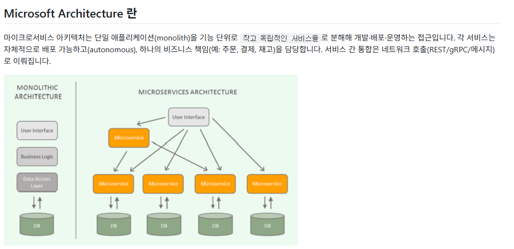

1. 장점
- 팀 생산성 & 독립 배포: 서비스 단위로 팀을 분리해 병렬 개발/배포 가능
- 유연한 기술 선택: 서비스마다 적합한 언어/DB 선택 가능
- 확장성: 병목 서비스만 수평 확장 가능 → 비용 효율적
- 격리성: 한 서비스 오류가 전체로 전파되는 위험 감소(잘 설계하면)
- 더 빠른 배포 사이클: 작은 변경만 배포 → 배포 리스크 감소

2. 단점 / 트레이드오프
- 복잡성: 분산 시스템으로 전환되며 운영·추적·디버깅이 어려움
- 운영 비용 증가: 인프라(네트워크, 모니터링, 오케스트레이션) 필요
- 데이터 일관성 문제: 트랜잭션 관리가 어려워지고 eventual consistency가 요구됨
- 네트워크 지연 & 안정성 문제: 호출 실패/지연에 대한 대비 필요

Gateway (=react의 router)
하나의 통로로 여러 서비스를 열 수 있음
기존 방식에서는  
localhost:8000 , localhost:8001, localhost:8002로 각각 port에 맞게 열어야했다면  
기능별로 나눠서 msa를 사용하는 경우  
localhost:8000/app2, localhost:8000/app1, localhost:8000/app2/docs 처럼 path를 이용하여 각각의 서비스를 이용할 수 있음

fastapi는 이 기능이 없어서 java로 해야함. 근데 우리 자바 안 배웠으니까 fastapi로 강제로 만들어줌
[0224_gateway](./0224_gateway.py)