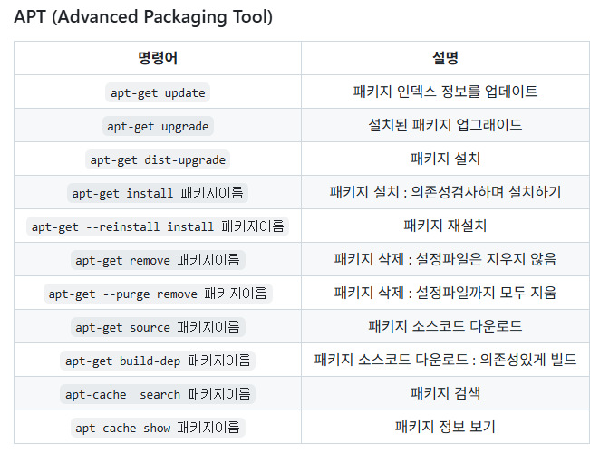
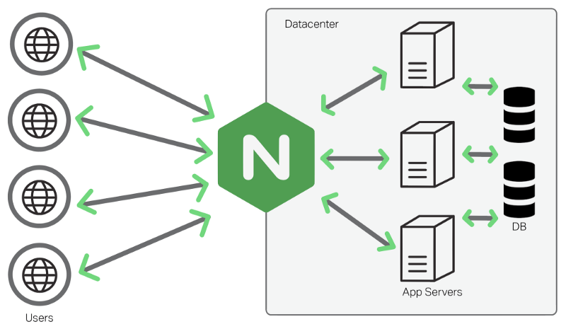

Docker란?
- 각 어플리케이션이 독립적으로 격리된 환경을 구성해주는 가상환경
=> 이 각 독립환경을 연결해주는게 `브릿지`
- 브릿지란?
  : 격리화된 내부 컨테이너들을 연결해주는 네트워크
  : 새로운 네트워크 망이 생김
    도커에서 “네트워크 망”이 생긴다는 건
    도커가 내부에 이런 걸 하나 만든다는 말👇
    ```
    가상의 네트워크 공간
    컨테이너마다 IP 주소를 부여
    같은 망에 있는 컨테이너끼리는 서로 패킷 전송 가능
    다른 망과는 자동으로 분리(격리)
    ```
-----

## network
```
// 생성 명령어
docker network create my-net(얘는 내가 설정하는 이름)

// 확인 명령어
docker network ls  
// 출력
NETWORK ID     NAME                           DRIVER    SCOPE
259733eb9d6a   bridge                         bridge    local

// 상세 확인 명령어
docker network inspect my-net(이름)
// 출력
[
    {
        "Name": "my-net",
        "Id": "c7fb32fa61e6ffc51d2f61666d91d3a5516cda123fdaf243fcc47430d43e94fa",
        "Created": "2026-02-05T01:15:39.099068833Z",
        "Scope": "local",
        "Driver": "bridge",
        "EnableIPv4": true,
        "EnableIPv6": false,
        "IPAM": {
            "Driver": "default",
            "Options": {},
            "Config": [
                {
                    "Subnet": "172.20.0.0/16",
                    "Gateway": "172.20.0.1"     //이게 ip 얘로 컨테이너를 생성하면 다음 "IPAddress": "172.17.0.2"는 2가 됨
                }
            ]
        },
        "Internal": false,
        "Attachable": false,
        "Ingress": false,
        "ConfigFrom": {
            "Network": ""
        },
        "ConfigOnly": false,
        "Options": {
            "com.docker.network.enable_ipv4": "true",
            "com.docker.network.enable_ipv6": "false"
        },
        "Labels": {},
        "Containers": {},
        "Status": {
            "IPAM": {
                "Subnets": {
                    "172.20.0.0/16": {
                        "IPsInUse": 3,
                        "DynamicIPsAvailable": 65533
                    }
                }
            }
        }
    }
]
```

특정 컨테이너 네트워크 확인

```
docker inspect 컨테이너명
docker inspect -f "{{.NetworkSettings.Networks}}" 컨테이너명
```


## volume
compose.yml에서 사용하는 volume
```
services:
  react.shellfolder.com:
    container_name: react.shellfolder.com
    image: node:24.13.0
    depends_on:
      - fastapi.shellfolder.com
    ports:
      - 5173:5173
    volumes:                        //이거!
      - ./frontend:/workspace 
    command: ["sleep", "infinity"]
```
여기의 volume은 도커의 볼륨이 아니라 내 pc 드라이브에 저장되어있는 외부 volume이라서 도커를 지워도 남아있음 

도커 내부의 volume
```
C:\Users\hi\Desktop\수아\0205\0205>docker volume ls
DRIVER    VOLUME NAME
local     38065498f76532572bf2bfdda4e559cabb126fb77142d8dfe2c7418712fd0416
local     vscode
```
여기의 volume은 도커 내부에만 존재하기 때문에 도커를 삭제하면 날아감

## container
각 개발환경을 구성한 독립적인 가상환경
```
C:\Users\hi\Desktop\수아\0205\0205>docker container ls
CONTAINER ID   IMAGE            COMMAND                   CREATED        STATUS          PORTS
                         NAMES
05da9137eab1   redis:8.4.0      "docker-entrypoint.s…"   16 hours ago   Up 10 minutes   0.0.0.0:6379->6379/tcp, [::]:6379->6379/tcp   redis
d8a69276cf66   mariadb:12.1.2   "docker-entrypoint.s…"   16 hours ago   Up 10 minutes   0.0.0.0:3306->3306/tcp, [::]:3306->3306/tcp   mariadb
```

내가 생성한 컨테이너를 보여줌

## Docker 실행하기

1. Docker 앱 실행하기
2. Docker hub에서 이미지 다운로드 CLI
이미지가 있어야 컨테이너를 생성할 수 있음(의존적임)

이미지란?
Docker 컨테이너를 생성하기 위한 지침이 담긴 읽기 전용 템플릿
- 일반적으로 이미지는 다른 이미지를 기반으로 하며, 몇 가지 추가적인 사용자 정의 사항이 포함됨
```
ubuntu 이미지   //기반이미지
  ↓
python 이미지 
  ↓
내가 만든 fastapi 이미지
```
=> fastapi를 쓰기 위해서는 기반인 python이 필요하고 python을 쓰기 위해선 기반 운영체제인 ubuntu가 필요함
:이후의 숫자를 태그라고 하고 해당 라이브러리의 버전임
=> 최신 버전을 확인하기 위해 그 이미지의 실제페이지에 가서 안정적인 최신 버전을 확인 후 도커에서 Tag 검색해서 받으면 됨

#### 이미지 다운로드
```bash
docker pull ubuntu:24.04
```

- `docker`: 도커 명령어
- `pull`: 다운받음
- `ubuntu`: 이미지 이름
- `:`: 이미지 이름과 태그 구분자
- `24.04`: 태그 이름(버전)
=> 태그 생략하면 lastes로 받아짐(현재 시점 가장 최신버전, 안정성 보장 못함)


#### UV 이미지 생성 in dokcerfile

```bash
FROM python:3.13.11

RUN apt-get update
RUN apt-get upgrade -y
RUN curl -LsSf https://astral.sh/uv/install.sh | sh
RUN pip install uv

WORKDIR /workspace

EXPOSE 8000
```

#### Docker 이미지 확인
```
docker images
```

#### Docker 컨테이너 생성
```
docker run -d -it --name ubt ubuntu:24.04
```
docker run [옵션] [컨테이너명] [도커 이미지]

run: 다운+실행 한번에 해주는 명령어
- `-d`: 컨테이너를 백그라운드에서 동작하도록 함
        터미널을 점유하지 않음 => 안 쓰면?? 터미널에 로그가 계속 찍힘(개발테스트할 땐 없이 써도 됨)
- `-it`: 운영체 주소로 접속할 수 있음(t:터미널처럼 생기게 만들어줘서 i:입력할 수 있게 함)
- `--name`: 이름 지정

```
출력
d890aa89ab7f85e1f0829e391857c200cca6dfb5690b968215cb8c0ed83489fa
```
👆이미지 이름

* 내가 만든 network로 시작
```
docker run --network=my-net -d -p 80:80 --name web nginx:1.28
```
- `--network=넷웤이름`
- `-p 80:80`: port코딩, :앞-외측=window포트, :뒤- 내측= docker포트
              얘가 있어야 포트 연결이 되어서 **웹사이트로 열 수 있음**
- 이미지는 항상 마지막

### 옵션 없이 만들면 어떻게 돼요??
ex) `docker run nginx:1.28`
하면 docker container가 생성되기는 하나 웹사이트에서 볼 수 없음
=> 도커 앱 컨테이너에 가서 container ID 복사해오고
```
docker exec -it 4805e4c45b3e57245961dd06b57ac9e2506b7960f14673f866e7f7c56182f1a7 /bin/bash
```
명령어로 실행하면 (이름은 앞에 4글자 이상만 적어도 인식해옴)
`root@4805e4c45b3e:/#` 이렇게 접속 가능해짐
`curl http://localhost:80/`
입력하면 해당 컨테이너가 작동하는지 알 수 있음
여기 localhost대신 컨테이너 명을 입력해도 알 수 있음

### 컨테이너 생성시 파일 함께 제작하기
```
docker run -d -p 80:80 -v ./index.html:/usr/share/nginx/html/index.html --name web nginx:1.28
```

- `-v 호스트 경로:컨테이너 경로`: volume 마운트 옵션(마운트가 연결해서 붙인다는 뜻임)
                              호스트경로:컨테이너경로를 연결해주는 옵션 코드

---

## docker run 명령어 옵션 최종정리
**옵션(option)**
- `-p`: 포트매핑
- `-d`: 백그라운드에서 실행하겠다
- `-v`: 볼륨(파일을) 마운트하겠다(연결해서 붙이겠다)
- `-it`: CLI처럼 터미널에서 키보드로 입력해서 명령하겠다
- `-e`: 환경변수 설정
        `-e MYSQL_ROOT_PASSWORD=1234` 처럼 DB나 서버 설정을 `e`로 함
- `-w`
- `--name`: 이름 지정
- `--rm`: remove, 삭제. --rm -f하면 켜져있으나 꺼져있으나 강제로 지워줌
- `--rmi`: 이미지 삭제
- `docker images`: 갖고있는 이미지 확인
- `--network`: 네트워크 지정(여러 컨테이너를 같은 네트워크로 연결 가능)
- `docker network ls`: 모든 네트워크 리스트 보기
- `docker network inspect 네트워크명`: 특정 네트워크 상세보기(docker container inspect에서도 확인 가능)
- `docker inspect 컨테이너명`: 특정 컨테이너 네트워크보기(docker container inspect에서도 확인 가능)
- `--restart`
- `docker logs 컨테이너명`: 컨테이너 로그 확인 가능(오류 볼 수 있음)

**명령(command)**
- `/bin/bash`

**구성**
- 이미지:

----

#### 운영체제 접속
```
docker exec -it ubt /bin/bash
```
- ubt 방금 내가 만든 이름
- /bin/bash: bash 방식으로 접속하겠다
```
출력
root@d890aa89ab7f:/# 
```
=>리눅스가 됨
-root: 사용자

docker 앱에 containers->Files들어가면 파일 어떻게 관리되어있는지 볼 수 있음

#### Docker/Linux 명령어

`ls` 한줄로 리스트 출력
`ls -l`: 깔끔하게 목록으로 출력
`ls -la`: 숨겨진 것 까지 출력
`su`: 사용자 변경
`su -`: 원래 사용자로 돌아감(But 비번 물어봄)
`exit`입력하면 취소하고 나가짐 ==> 이전으로 돌아가짐(user 잘못 바꿨을 때 쓰면 돌아올 수 있음)
`whoami`: 접속 사용자 확인
`useradd -m -s /bin/bash -c "홍길동" hong`: 사용자 생성 명령어
                                           "홍길동": 설명
                                           hong: 실제 이름
                                           
`passwd`: 비밀번호 지정
`cd ~`: 본인의 가장 첫 위치로 감
`mkdir`: 디렉토리 만들기
`rm`: 컨테이너 삭제
`rm -f`: 실행중이든말든 강제삭제
`ps`:


버전에 따라 get은 생략 가능함

`install -y`: `-y`는 질문 생략하고 무조건 깔라는 명령어
`install python3 -y`하면 python사용 가능
`python3 main.py`로 실행
`vi`: 메모장처럼 쓸 수 있음
`vi main.sh`: 뒤에 붙는게 파일명.sh 확장자
ifconfig 쓰는법
`apt update`로 업데이트 후
`apt install net-tools`로 네트워크 툴 설치 후
`ifconfig` 쓰면
```
eth0: flags=4163<UP,BROADCAST,RUNNING,MULTICAST>  mtu 1500
        inet 172.17.0.2  netmask 255.255.0.0  broadcast 172.17.255.255  //inet이 내 네트워크
        ether 4e:90:ad:a0:8f:01  txqueuelen 0  (Ethernet)
        RX packets 20271  bytes 28952754 (27.6 MiB)
        RX errors 0  dropped 0  overruns 0  frame 0
        TX packets 19781  bytes 1458864 (1.3 MiB)
        TX errors 0  dropped 0 overruns 0  carrier 0  collisions 0

lo: flags=73<UP,LOOPBACK,RUNNING>  mtu 65536
        inet 127.0.0.1  netmask 255.0.0.0
        inet6 ::1  prefixlen 128  scopeid 0x10<host>
        loop  txqueuelen 1000  (Local Loopback)
        RX packets 12  bytes 1806 (1.7 KiB)
        RX errors 0  dropped 0  overruns 0  frame 0
        TX packets 12  bytes 1806 (1.7 KiB)
        TX errors 0  dropped 0 overruns 0  carrier 0  collisions 0
```
이렇게 출력됨
- lo: Loopback 인터페이스, 나 자신에게 보내는 전용 통신선
      자기자신 테스트용, 내부 프로세스간의 통신
- eth0: 실제 네트워크에 연결된 인터페이스 => 즉, 컨테이너가 네트워크 망에 받은 IP

vsCode -Extensions(확장자 설치)에 remote 검색 후

이거 설치하면 `vi`없이도 편하게 사용할 수 있음

포트코드
포트를 강제로 지정해주는 코드
`docker run -d -it -p 80:5173 --name nd node:24.13.0`

여기 -p 이후에 써주는게 강제 지정됨
이후에 만든 폴더에 가서 vite.configs에 
```
export default defineConfig({
  plugins: [react()],
  base:"/",
  server: {
    host: true
  }
})
```

👆 이 설정 넣어주면 됨
그리고 뜬 local브라우저 접속 후 5173날리고 80입력하면 뜸

# devcontainer로 실행하기
`ctrl`+ `shift`+ `P`


## ping
네트워크 연결 여부 확인 + 대상이 실제로 존재하는지 확인하는 용도
```
apt install -y iputils-ping
ping 172.20.0.3
```

했을 때 답변이 오면 살아있고 연결이 되어있는거임
ip로 사용도 가능하지만 container name으로도 할 수 있음
```
ping
```
# Nginx



## Nginx 화면 경로
```
/usr/share/nginx/html/index.html
```

여기 들어가서 편집하면 url로 들어간 웹 화면 수정 가능
한글 쓰고싶으면 `<head>` 안에 `<meta charset='utf-8'>`


# dockerfile
파일명 dockerfile로 하면 확장자 없이 자동으로 됨
- FROM: 기본 대상 이미지를 정의하는 속성
      **무조건 첫줄**
```
FROM ubuntu:24.04
```
- MAINTAINER: 작성자 정보를 기록하는 속성(잘 안 씀)
- WORKDIR: 작업 디렉토리
         이후 명령들의 기준 위치
         `cd`랑 비슷하지만 영구적으로 지정해줌
```
WORKDIR /app
```
- RUN: 실행시킬 명령어 정의
```
RUN apt update
RUN apt install -y nginx
```
- COPY: 도커 컨테이너의 경로로 파일을 복사할 때 사용하는 속성
        빌드 시점에만 동작함
        COPY 로컬 **띄우고!!** 컨테이너
```
COPY ./index.html /var/www/html/index.nginx-debian.html
COPY . .     //=> 앞의 . 모든 파일 복사 뒤의 . workdir에 전부 붙여넣기
```
위에 FROM으로 하나 build 한 이후에 다시 시작할 경우
```
FROM node:24.13.0 as build

WORKDIR /app

COPY package.json ./
RUN npm install 

COPY . .

RUN npm run build
# build 하고나면 사라짐 아래 FROM부터 다시 시작

FROM nginx:1.28
COPY --from=build /app/dist /usr/share/nginx/html 
```
이 경로는 검색해보거나 느낌으로 찾은 다음에 edit 창 누르면 경로가 맨 위에 나옴  
-> 이걸 복사해오기

- ENV: 도커 컨테이너의 환경변수를 정의하는 속성
       컨테이너 내부에서 사용 가능
```
ENV MODE=prod
```
- EXPOSE: 포터 코드 지정하는 속성
        : `-p 80:80`이런 명령어로 포트 지정해주면 ESPOSE는 생략 가능함
          굳이 쓰는 이유는 협업시 다른 사람들이 아 80번 포트를 쓰는구나 하는 정보전달을 위함임
          `-P`만 쓸 경우 EXPOSE로 지정한 포트에 연결됨(Default Value같은 느낌)

```
EXPOSE 80
```

- ENTRYPOINT: 

- CMD: 컨테이너 실행 명령 속성
       docker run으로 나중에 덮어쓸 수 있음
```
CMD [ "nginx","-g","demon off;" ]
```
### 🤔 이 명령어 어디서 찾아요????
=> docker앱 -> Images -> 해당 이미지 클릭하면 명령어들이 쭉 나와있음

- VOLUME

### 설정 후 실행하기
!터미널 오픈
1. dir로 dockerfile 있는지 확인
2. `docker build -t web:0.0.1 .`:로 만들기
3. `docker images`로 이미지 만들어졌는지 확인
4. `docker run -d -p 80:80 --name web web:0.0.1`:로 실행
5. `docker ps`로 컨테이너 run 되었는지 확인
6. 웹사이트 url `localhost` 접속해서 확인

nginx는 정적파일을 서비스하기 때문에 react에서 router로 화면 전환을 해주려면 따로 정의를 해줘야함
docker app -> Files -> `/etc/nginx/conf.d/default.conf`요 주소 들어가서 Edit
->
```
    location / {
        root   /usr/share/nginx/html;
        index  index.html index.htm;
    }
```

```
       root   /usr/share/nginx/html;
        index  index.html index.htm;
    
  location / {
        try_files $uri /index.html;
    }
```

`COPY .default.conf /etc/nginx/conf.d/default/conf`

컨테이너 한번에 삭제하는 명령어
`docker rm -f $(docker ps -aq)`